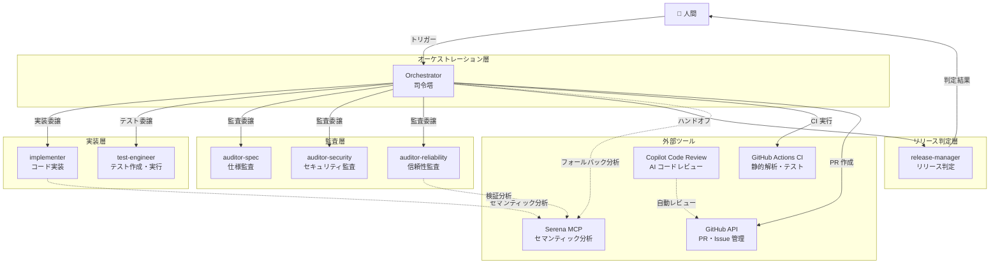
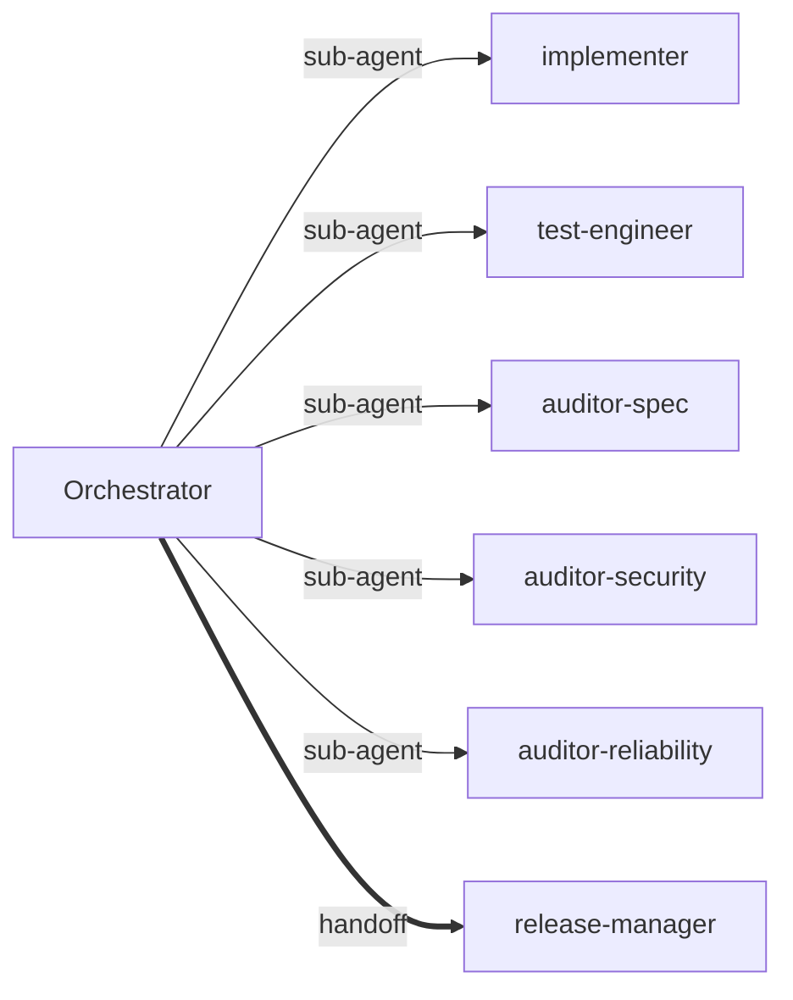
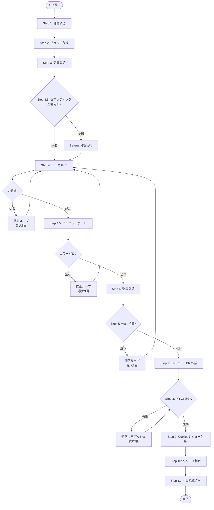
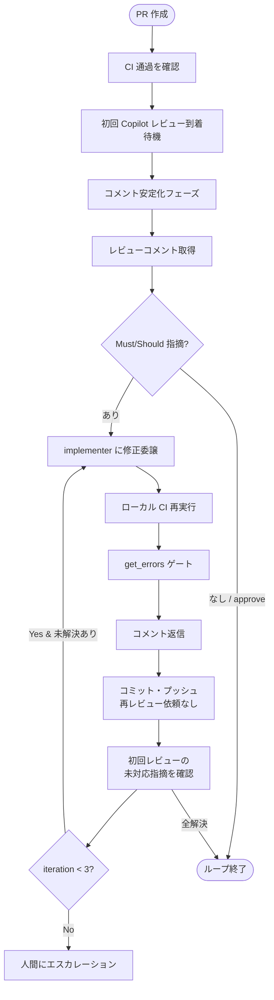
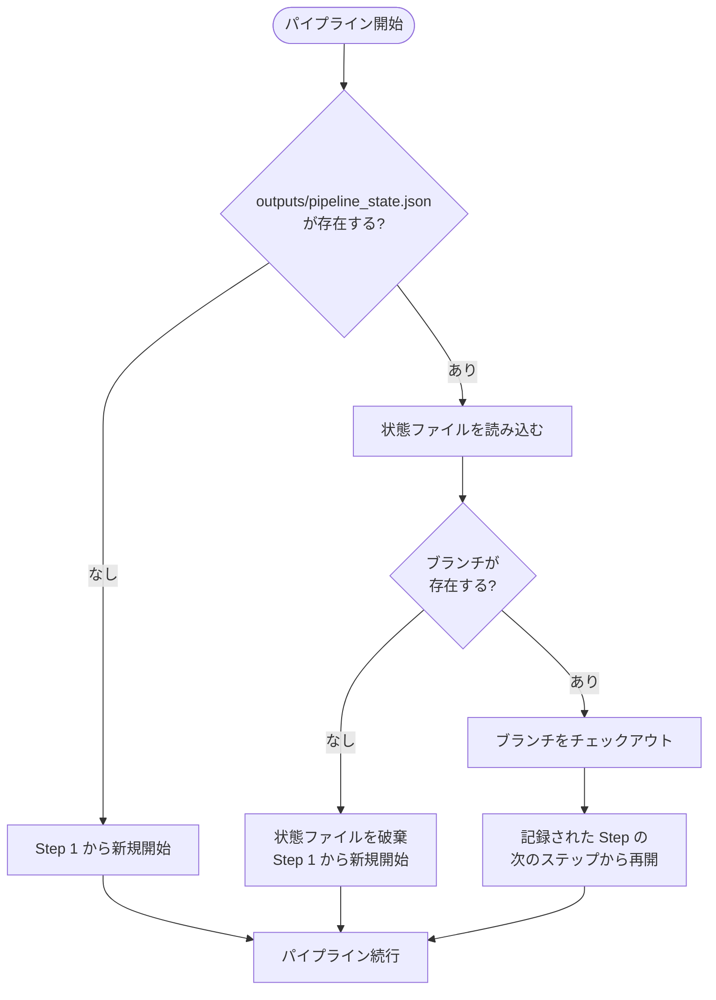

# オーケストレーション構成ドキュメント

> 本ドキュメントは、AI エージェントパイプラインの全体設計・構成・運用を一元的に管理するテンプレートである。
> プロジェクト固有の内容は `<!-- PROJECT: ... -->` コメントで示す。
> 実際のプロジェクトに適用する際は、これらのプレースホルダーを置き換えること。

## 目次

1. [全体アーキテクチャ](#1-全体アーキテクチャ)
2. [エージェント一覧](#2-エージェント一覧)
3. [パイプラインフロー](#3-パイプラインフロー)
4. [エージェント応答スキーマ](#4-エージェント応答スキーマ)
5. [Serena MCP 統合](#5-serena-mcp-統合)
6. [Copilot コードレビュー統合](#6-copilot-コードレビュー統合)
7. [CI/CD パイプライン](#7-cicd-パイプライン)
8. [AI モデル構成](#8-ai-モデル構成)
9. [パイプライン状態永続化](#9-パイプライン状態永続化)
10. [コスト管理](#10-コスト管理)
11. [AI Gateway 検討](#11-ai-gateway-検討)
12. [構成ファイル一覧](#12-構成ファイル一覧)
13. [運用手順](#13-運用手順)
14. [設計検討メモ](#14-設計検討メモ)
15. [変更履歴](#15-変更履歴)

---

## 1. 全体アーキテクチャ

### 1.1 設計思想

本システムは **エージェント指向のソフトウェア開発パイプライン** を採用している。
人間の開発者が計画を承認し、AI エージェント群が自律的に実装・テスト・監査・リリース判定を行う。

主要な設計原則：

- **関心の分離**: 各エージェントは単一の責務を持つ
- **独立監査**: 監査エージェントは実装エージェントとは独立して判断する
- **フェイルクローズ**: 不確実な場合は安全側に倒す（P-010）
- **Human-in-the-loop**: 最終マージ判断は人間が行う
- **Bounded Recursion**: 修正ループには回数上限（最大3回）を設ける

### 1.2 システム構成図



### 1.3 動作モード

| モード | トリガーフレーズ | 内容 |
|---|---|---|
| 自動実行 | 「計画に従い作業を実施して」「Next を実行して」等 | plan.md の Next タスクを自律実行 |
| 計画修正 | 「計画を修正して」「Issue を追加して」等 | plan.md / GitHub Issues / Project を更新 |
| 汎用リクエスト | 上記以外 | 改善提案・調査・リファクタリング等（PR を伴う場合は自動実行 Step 6-12 相当の PR フローを追加適用。copilot-instructions.md General Request セクション参照） |
| モデル最適化 | 「モデルを最適化して」「モデルを見直して」等 | AI モデル割当の提案・変更 |

---

## 2. エージェント一覧

### 2.1 エージェント定義サマリ

| エージェント | ファイル | 責務 | 呼出可能 | MCP |
|---|---|---|---|---|
| Orchestrator | `orchestrator.agent.md` | パイプライン全体の指揮・統合 | ✅ | ✅ |
| implementer | `implementer.agent.md` | コード実装・docs 更新 | ❌ | ✅ |
| test-engineer | `test-engineer.agent.md` | テスト作成・実行 | ❌ | ❌ |
| auditor-spec | `auditor-spec.agent.md` | 仕様整合性の監査 | ❌ | ❌ |
| auditor-security | `auditor-security.agent.md` | セキュリティ監査 | ❌ | ❌ |
| auditor-reliability | `auditor-reliability.agent.md` | 信頼性・テスト品質監査 | ❌ | ✅ |
| release-manager | `release-manager.agent.md` | リリース可否の最終判定 | ✅ | ❌ |

### 2.2 ツールマトリクス

| ツール | Orch | Impl | Test | A-Spec | A-Sec | A-Rel | RM |
|---|---|---|---|---|---|---|---|
| agent | ✅ | - | - | - | - | - | - |
| read | ✅ | ✅ | ✅ | ✅ | ✅ | ✅ | ✅ |
| editFiles | ✅ | ✅ | ✅ | - | - | - | - |
| runInTerminal | ✅ | ✅ | ✅ | - | - | - | ✅ |
| search | ✅ | ✅ | ✅ | ✅ | ✅ | ✅ | ✅ |
| search/usages | - | - | - | ✅ | ✅ | ✅ | - |
| web/fetch | ✅ | - | - | ✅ | - | - | ✅ |
| web/githubRepo | ✅ | - | - | - | - | - | ✅ |
| mcp (Serena) | ✅ | ✅ | - | - | - | ✅ | - |

### 2.3 エージェント連携（委譲関係）



- **sub-agent**: Orchestrator が呼び出し、結果を受け取る（制御は Orchestrator に戻る）
- **handoff**: Orchestrator が制御ごと引き渡す（release-manager が最終判定を行う）

### 2.4 各エージェントの詳細

#### Orchestrator

- **責務**: パイプライン全体の指揮。タスク分解、エージェント委譲、結果統合。**自らコードは書かない。**
- **サブエージェント**: implementer, test-engineer, auditor-spec, auditor-security, auditor-reliability
- **ハンドオフ先**: release-manager
- **制約**: Next 以外のタスクに着手しない / Backlog を勝手に開始しない / ポリシー違反検出時は即停止

#### implementer

- **責務**: ソースコードの実装と `docs/` の更新
- **制約**: P-001（禁止操作）/ P-002（秘密情報禁止）を厳守
- **Serena 利用**: Shift-Left で実装前・中・後にセマンティック分析を実施（第1層）

#### test-engineer

- **責務**: 単体テスト / 境界値テスト / 統合テスト / 再現性テストの作成・実行
- **制約**: ダミーデータのみ使用 / 実データ禁止

#### auditor-spec

- **責務**: `requirements.md` / `policies.md` / `constraints.md` との整合性を独立監査
- **出力**: Must / Should / Nice に分類された指摘リスト

#### auditor-security

- **責務**: P-001（禁止操作）/ P-002（秘密情報禁止）/ P-040（依存関係）の監査
- **特徴**: 最も制限されたツールセット（editFiles / runInTerminal なし）

#### auditor-reliability

- **責務**: 再現性（NFR-001）/ テスト品質（NFR-020）/ エラーハンドリング（P-010）の監査
- **Serena 利用**: Stage 3 で条件付きセマンティック検証（第3層）

#### release-manager

- **責務**: 全監査結果を統合し、受入条件（AC）をチェックして PR のマージ可否を判定
- **制約**: コードを変更しない / 最終マージは人間が行う

---

## 3. パイプラインフロー

### 3.1 自動実行パイプライン全体像



### 3.2 各ステップの詳細

<!-- PROJECT: CI コマンドはプロジェクトのツールチェインに合わせて変更すること -->

#### Step 1: 計画読込

- `docs/plan.md` の Next セクション先頭タスクを選択
- 起動時読込ファイル: `docs/plan.md`, `docs/requirements.md`, `docs/policies.md`, `docs/constraints.md`, `docs/architecture.md`

#### Step 2: ブランチ作成

- `feat/<タスクID>-<説明>` 形式のフィーチャーブランチを作成

#### Step 3: 実装委譲

- **implementer** にコード実装を委譲
- **test-engineer** にテスト作成を委譲
- implementer は Serena MCP を活用して Shift-Left 分析を実施（§4 参照）

#### Step 3.5: セマンティック影響分析（条件付き）

- **条件**: `src/` の公開 API / シグネチャが変更された場合
- **実行**: Orchestrator が Serena MCP で影響分析を実行
- **目的**: implementer が未実施の場合のフォールバック

#### Step 4: ローカル CI

<!-- PROJECT: CI コマンドはプロジェクトに合わせて変更 -->

失敗時は implementer に修正を指示し、最大3回ループ。

#### Step 4.5: IDE エラーゲート

- `get_errors` ツール（filePaths 省略）でワークスペース全体のエラーを取得
- **エラーがゼロになるまで Step 5 に進まない**

#### Step 5: 監査委譲（並列実行）

3つの監査エージェントを **可能な限り並列に** 呼び出す。
Orchestrator はサブエージェント呼び出しを1つずつ待機するのではなく、独立性のある3つの監査を同時に発行することが望ましい。
ただし、フレームワークの制約により逐次実行しかサポートされない場合は、その旨をパイプラインログに記録する。

> **注記**: 並列実行の可否は利用するプラットフォーム（Copilot Chat / Agent Framework 等）に依存する。
> 逐次実行でも機能的な問題は発生しないが、パイプライン実行時間が増大する。

#### Step 6: 修正ループ

- Must 指摘が 1 件以上 → implementer に修正指示 → Step 4 から再実行
- 最大3回のループで解決しない場合は停止

#### Step 7: コミット・プッシュ・PR 作成

- Conventional Commit フォーマットでコミット
- PR 本文は `--body-file` で一時ファイル経由（`--body` は禁止）
- PR 本文に `Closes #XX` を記載

#### Step 8: PR CI 検証

- `gh pr checks <PR番号> --watch` で CI 結果を監視
- 失敗時は修正 → 再プッシュ（最大3回）

#### Step 9: Copilot コードレビュー対応（初回レビューのみ）

§6 で詳述。初回レビューのみ取得し、最大3回のイテレーションで指摘対応。

#### Step 10: リリース判定

- **release-manager** にハンドオフ
- 承認された場合、「マージ可能」と人間に報告

#### Step 11: 人間承認待ち

- **人間の最終承認なしにマージは実行しない**（自動マージ禁止）

### 3.3 停止条件

- ポリシー違反（P-001〜P-003）の検出
- 修正ループが3回を超えた
- サブエージェントから解決不能なエラーが報告された
- `docs/plan.md` の Next が空
- 予算超過（推定トークン消費が Budget cap を超過。§10 参照）

---

## 4. エージェント応答スキーマ

### 4.1 概要

各サブエージェントが Orchestrator に報告する際のフォーマットを標準化する。
これにより、Orchestrator はエージェント応答を一貫した形式で解析・統合できる。

> **注意**: 現時点では Copilot Chat の制約上、JSON スキーマの強制的なバリデーションは実装できない。
> 本スキーマはドキュメントベースの規約として定義し、将来のフレームワーク移行時に型安全化する設計とする。

### 4.2 共通応答スキーマ

すべてのサブエージェントは、報告に以下のフィールドを含めること。

| フィールド | 型 | 必須 | 説明 |
|---|---|---|---|
| `status` | `"success" \| "failure" \| "partial"` | ✅ | タスクの完了状態 |
| `summary` | `string` | ✅ | 結果の自然言語要約（1〜3文） |
| `findings` | `Finding[]` | ❌ | 具体的な指摘事項のリスト（監査エージェント必須） |
| `metrics` | `Metrics` | ❌ | 定量的な指標（該当する場合） |

#### `Finding` オブジェクト

| フィールド | 型 | 必須 | 説明 |
|---|---|---|---|
| `severity` | `"Must" \| "Should" \| "Nice"` | ✅ | 指摘の深刻度 |
| `file` | `string` | ✅ | 対象ファイルの相対パス |
| `line` | `number \| null` | ❌ | 対象行番号（特定できない場合は null） |
| `message` | `string` | ✅ | 指摘内容の説明 |

#### `Metrics` オブジェクト

| フィールド | 型 | 必須 | 説明 |
|---|---|---|---|
| `tests_added` | `number` | ❌ | 追加されたテスト数 |
| `tests_passed` | `number` | ❌ | 通過したテスト数 |
| `tests_failed` | `number` | ❌ | 失敗したテスト数 |
| `coverage` | `number \| null` | ❌ | テストカバレッジ（%） |
| `files_changed` | `number` | ❌ | 変更されたファイル数 |
| `lines_added` | `number` | ❌ | 追加行数 |
| `lines_removed` | `number` | ❌ | 削除行数 |

### 4.3 エージェント別の応答要件

| エージェント | `status` | `summary` | `findings` | `metrics` |
|---|---|---|---|---|
| implementer | ✅ | ✅ | ❌（任意） | ✅（files_changed, lines_added/removed） |
| test-engineer | ✅ | ✅ | ❌（任意） | ✅（tests_added, tests_passed/failed, coverage） |
| auditor-spec | ✅ | ✅ | ✅（必須） | ❌ |
| auditor-security | ✅ | ✅ | ✅（必須） | ❌ |
| auditor-reliability | ✅ | ✅ | ✅（必須） | ❌ |
| release-manager | ✅ | ✅ | ✅（必須） | ❌ |

### 4.4 応答例

#### 監査エージェントの応答例

```json
{
  "status": "partial",
  "summary": "仕様監査完了。Must 指摘1件、Should 指摘2件を検出。",
  "findings": [
    {
      "severity": "Must",
      "file": "src/sample/calculator.py",
      "line": 42,
      "message": "requirements.md の AC-003 で要求されている入力バリデーションが未実装。"
    },
    {
      "severity": "Should",
      "file": "src/sample/calculator.py",
      "line": 15,
      "message": "docstring が Google Style に準拠していない。"
    }
  ],
  "metrics": null
}
```

#### implementer の応答例

```json
{
  "status": "success",
  "summary": "AC-003 の入力バリデーションを実装し、対応するユニットテストを追加。",
  "findings": [],
  "metrics": {
    "files_changed": 2,
    "lines_added": 45,
    "lines_removed": 3
  }
}
```

### 4.5 将来の型安全化ロードマップ

1. **Phase 1（現在）**: ドキュメントベースの規約として運用。Orchestrator が応答の形式を目視確認。
2. **Phase 2**: JSON Schema ファイル（`schemas/agent_response.json`）を作成し、CI でバリデーション。
3. **Phase 3**: A2A（Agent-to-Agent）プロトコル移行時に、型安全なメッセージングフレームワークで強制。

---

## 5. Serena MCP 統合

### 5.1 概要

Serena MCP はセマンティックなコード理解（シンボル検索、参照元追跡、構造把握）を提供するツールサーバーである。
**Shift-Left + ターゲット分析** アプローチを採用し、3層で統合する。

### 5.2 接続構成

```jsonc
// .vscode/mcp.json
{
  "servers": {
    "serena": {
      "command": "uvx",
      "args": [
        "--from", "git+https://github.com/oraios/serena",
        "serena", "start-mcp-server",
        "--context", "ide-assistant",
        "--project", "${workspaceFolder}"
      ],
      "type": "stdio"
    }
  }
}
```

### 5.3 3層統合モデル

| 層 | エージェント | タイミング | 目的 |
|---|---|---|---|
| 第1層（主要） | implementer | 実装前・中・後 | コード構造把握、参照元チェック、変更整合性確認 |
| 第2層（補完） | Orchestrator | Step 3.5 | implementer 未実施時のフォールバック影響分析 |
| 第3層（検証） | auditor-reliability | Stage 3 | 前段分析結果のスポットチェック or フォールバックフル分析 |

### 5.4 条件付き実行ルール

| 変更種別 | Serena 実行 |
|---|---|
| `src/` の公開 API / シグネチャ変更 | **必須** |
| `src/` の内部ロジック変更 | 推奨 |
| テスト / docs / config のみ | スキップ |
| MCP 利用不可 | スキップ（従来の方法で代替） |

---

## 6. Copilot コードレビュー統合

### 6.1 概要

GitHub Copilot Code Review は **PR 作成時に自動トリガーされる初回レビューのみ** を対象とする。
修正 push 後の再レビュー依頼は API 制限により自動化不可能であるため、
**静的解析（CI + get_errors）の通過をもって品質ゲート** とする。

### 6.2 技術的背景（API 制限）

API 経由での Copilot 再レビュー依頼は以下のすべてが失敗する（2025-07 検証済み）：

| 方法 | 結果 |
|---|---|
| REST API `POST /requested_reviewers` | Bot に対しては `requested_reviewers: []`（無視） |
| GraphQL `requestReviews` | Bot ノード ID を User として解決できない |
| dismiss → 再リクエスト | COMMENTED レビューは dismiss 不可（422 エラー） |

唯一の再レビュー手段は GitHub GUI の「Re-request review」ボタンのみ。

### 6.3 設計原則

| # | 原則 | 説明 |
|---|---|---|
| 1 | 初回レビューのみ取得 | PR 作成時の自動トリガーによる初回レビューのみを対象（再レビュー依頼は API 制限により不可能） |
| 2 | 静的解析が品質ゲート | 修正 push 後は CI + get_errors の通過をもって品質を担保する（再レビューの代替） |
| 3 | Bounded Recursion | 初回レビュー指摘への対応は最大3回のイテレーションで制限 |
| 4 | 静的解析ファースト | AI レビューの前に CI + get_errors を必ず通過させ、再レビューの代替としても静的解析を用いる |

### 6.4 レビュー対応フロー



### 6.5 指摘の分類

| 分類 | 対応 |
|---|---|
| **Must** | マージ前に修正必須 |
| **Should** | 強く推奨（時間が許せば修正） |
| **Nice** | 今回はスキップ可 |

---

## 7. CI/CD パイプライン

<!-- PROJECT: CI ワークフローとコマンドはプロジェクト固有の設定に合わせる -->

### 7.1 GitHub Actions ワークフロー

ファイル: `.github/workflows/ci.yml`

### 7.2 セキュリティ制約

- `permissions` は必要最小限を明示的に指定
- `permissions: write-all` は禁止
- サードパーティ Action はコミットハッシュで固定（タグ指定は禁止）

---

## 8. AI モデル構成

### 8.1 現在の設定

設定ファイル: `configs/ai_models.toml`

<!-- PROJECT: 現在のモデル設定を記載 -->

### 8.2 モデル選定ガイドライン

具体的なモデル名とバージョンは陳腐化が早いため、本ドキュメントには記載しない。
現在のプロジェクトで使用中のモデル設定は **`project-config.yml`** の `ai_models` セクションを正本とする。

#### コスト階層と選定基準

| 階層 | コスト倍率 | 適用エージェント | 選定基準 |
|---|---|---|---|
| 無料 / 低コスト | 0x〜0.33x | 反復的・単純なタスク | 速度重視、品質要求が低い場合 |
| スタンダード | 1x | implementer, test_engineer, auditor_* | コードベンチマーク（SWE-bench 等）上位のモデル |
| プレミアム | 3x | orchestrator, release_manager | 深い推論・複雑な判断が必要な場合 |

#### 選定時の評価軸

1. **コードベンチマーク**: SWE-bench Verified, TerminalBench 等のエージェントタスク性能
2. **コスト効率**: Premium 利用率を全体の 20% 以下に抑える（§10 コスト管理参照）
3. **レイテンシ**: 反復タスク（テスト生成、監査）は低レイテンシモデルを優先
4. **互換性**: VS Code Copilot Chat のモデル選択で利用可能であること

#### プロバイダー公式リファレンス

最新のモデル一覧・性能・価格は各プロバイダーの公式ドキュメントを参照する：

- GitHub Copilot: [GitHub Copilot モデル一覧](https://docs.github.com/en/copilot/using-github-copilot/ai-models/choosing-the-right-ai-model-for-your-task)
- Anthropic: [Claude モデル一覧](https://docs.anthropic.com/en/docs/about-claude/models)
- OpenAI: [GPT モデル一覧](https://platform.openai.com/docs/models)
- Google: [Gemini モデル一覧](https://ai.google.dev/gemini-api/docs/models)

### 8.3 モデル変更手順

1. `configs/ai_models.toml` の `[ai_models.overrides]` セクションを編集
2. `bash scripts/update_agent_models.sh` を実行
3. 変更をコミット・プッシュ

---

## 9. パイプライン状態永続化

### 9.1 概要

パイプラインが中断（コンテキスト切れ、タイムアウト、ユーザー中断等）した場合に、
途中から再開できるよう、各ステップ完了時に状態を永続化する。

### 9.2 状態ファイル

- **パス**: `outputs/pipeline_state.json`
- **ライフサイクル**: パイプライン開始時に作成、各ステップ完了時に更新、パイプライン正常完了時に削除
- **gitignore**: `outputs/` は `.gitignore` 対象のため、リポジトリにコミットされない

### 9.3 状態ファイルフォーマット

```json
{
  "step": 5,
  "step_name": "監査委譲",
  "loop_count": {
    "ci_fix": 1,
    "audit_fix": 0,
    "pr_ci_fix": 0,
    "review_fix": 0
  },
  "branch": "feat/TASK-001-implement-feature",
  "task_id": "TASK-001",
  "pr_number": null,
  "audit_results": {
    "spec": null,
    "security": null,
    "reliability": null
  },
  "serena_analysis": false,
  "timestamp": "2026-02-27T10:30:00Z",
  "version": "1.0"
}
```

### 9.4 フィールド定義

| フィールド | 型 | 説明 |
|---|---|---|
| `step` | `number` | 最後に完了したステップ番号（1〜11） |
| `step_name` | `string` | ステップ名（人間向け表示用） |
| `loop_count` | `object` | 各修正ループの現在回数 |
| `branch` | `string` | フィーチャーブランチ名 |
| `task_id` | `string` | 対象タスクの ID |
| `pr_number` | `number \| null` | 作成済み PR 番号（Step 7 以降） |
| `audit_results` | `object` | 各監査エージェントの結果サマリ |
| `serena_analysis` | `boolean` | Serena 影響分析を実施済みか |
| `timestamp` | `string` | 最終更新日時（ISO 8601） |
| `version` | `string` | 状態ファイルフォーマットのバージョン |

### 9.5 復旧フロー



### 9.6 復旧時の注意事項

- **ブランチ不在**: 状態ファイルに記録されたブランチがリモートに存在しない場合、状態ファイルを破棄して新規開始する
- **ループカウント**: 復旧時は状態ファイルのループカウントを引き継ぐ。復旧前後を合算して最大3回の制限を適用する
- **監査結果**: 復旧時に監査結果が存在する場合、再監査をスキップし Step 7 以降から再開できる
- **タイムアウト**: 状態ファイルの `timestamp` が24時間以上経過している場合、古い状態として警告を表示する（破棄はしない）

---

## 10. コスト管理

### 10.1 概要

パイプライン実行には AI モデルのトークン消費コストが発生する。
Bounded Recursion（最大3回の修正ループ）が全ステップで発動した場合の最大コストを
事前に見積もり、予算超過時に自動停止する仕組みを設ける。

### 10.2 モデル単価（参考値）

| モデル | 入力単価 ($/MTok) | 出力単価 ($/MTok) | 倍率 |
|---|---|---|---|
| Claude Opus 4.6 | $15 | $75 | 3x |
| Claude Sonnet 4.6 | $3 | $15 | 1x |

> **注意**: 上記は2026年2月時点の Copilot 外での参考単価。Copilot Chat 経由の場合は
> サブスクリプションプランに応じた Premium Request 課金となるため、直接的なトークン単価は適用されない。
> ここではコスト感覚の参考として記載する。

### 10.3 1パイプライン実行あたりの最大トークン推算

Worst case（全修正ループが最大3回発動）を前提とする。

| ステップ | エージェント | 入力 (KTok) | 出力 (KTok) | ループ倍率 | 入力合計 (KTok) | 出力合計 (KTok) |
|---|---|---|---|---|---|---|
| Step 1: 計画読込 | Orchestrator (Opus) | 50 | 5 | 1x | 50 | 5 |
| Step 2: ブランチ作成 | Orchestrator (Opus) | 10 | 2 | 1x | 10 | 2 |
| Step 3: 実装委譲 | implementer (Sonnet) | 80 | 30 | 1x | 80 | 30 |
| Step 3: テスト委譲 | test-engineer (Sonnet) | 60 | 20 | 1x | 60 | 20 |
| Step 4: ローカル CI | Orchestrator (Opus) | 20 | 5 | 3x | 60 | 15 |
| Step 4.5: エラーゲート | Orchestrator (Opus) | 15 | 3 | 3x | 45 | 9 |
| Step 5: 監査 (×3) | auditor (Sonnet) ×3 | 50×3 | 10×3 | 1x | 150 | 30 |
| Step 6: 修正ループ | implementer (Sonnet) | 60 | 20 | 3x | 180 | 60 |
| Step 7: PR 作成 | Orchestrator (Opus) | 20 | 5 | 1x | 20 | 5 |
| Step 8: PR CI 修正 | implementer (Sonnet) | 40 | 15 | 3x | 120 | 45 |
| Step 9: レビュー対応 | implementer (Sonnet) | 40 | 15 | 3x | 120 | 45 |
| Step 10: リリース判定 | release-manager (Opus) | 50 | 10 | 1x | 50 | 10 |
| **合計** | | | | | **945** | **276** |

### 10.4 最大コスト見積もり

上記推算に基づく最大コスト（参考値、非 Copilot 環境を想定）:

| モデル | 入力 (KTok) | 出力 (KTok) | 入力コスト | 出力コスト | 小計 |
|---|---|---|---|---|---|
| Opus 4.6 (Orch + RM) | 235 | 46 | $3.53 | $3.45 | $6.98 |
| Sonnet 4.6 (Impl + Test + Auditors) | 710 | 230 | $2.13 | $3.45 | $5.58 |
| **合計** | **945** | **276** | **$5.66** | **$6.90** | **$12.56** |

- **Typical case**（修正ループなし）: 約 $4〜$6
- **Worst case**（全ループ最大3回）: 約 $12〜$13
- **推奨 Budget cap**: **$15 / パイプライン実行**

### 10.5 予算超過時の自動停止条件

以下の条件に該当した場合、パイプラインを自動停止する:

1. **推定消費トークンが Budget cap を超過**: 各ステップ完了時に累計トークン消費を推算し、Budget cap（$15 相当）を超過した場合は停止する
2. **ループ回数の異常**: CI 修正 + 監査修正 + レビュー修正の合計が6回を超えた場合（各最大3回 × 修正種別は独立だが、合計で過剰な修正は予算超過の兆候）

停止時のアクション:
- パイプライン状態を `outputs/pipeline_state.json` に保存する（§9 参照）
- 人間にエスカレーション: 「予算上限に達しました。継続するか判断してください」

> **注記**: Copilot Chat 経由の現行アーキテクチャでは、正確なトークン消費を計測する手段がない。
> 将来的に AI Gateway（§11 参照）や OTel 計装（`observability-guide.md` 参照）を導入し、
> 実測値に基づく Budget cap の運用を目指す。

---

## 11. AI Gateway 検討

### 11.1 概要

AI Gateway（プロキシ）は、LLM API 呼び出しの可観測性・コスト管理・レート制限を
一元的に提供するミドルウェアである。将来的にプログラマティック API 呼び出しに移行した際の
導入を見据え、主要な候補を比較する。

### 11.2 現時点での制約

現行アーキテクチャでは **Copilot Chat 経由** でモデルを利用しているため、
AI Gateway を直接適用することはできない。以下の理由による:

- Copilot Chat の API 呼び出しは GitHub が管理しており、プロキシを挟む余地がない
- トークン消費量は Copilot のサブスクリプション課金に含まれる
- モデル選択は Copilot の設定 UI / エージェント定義で行う

### 11.3 候補比較表

| 項目 | LiteLLM | Portkey | Helicone |
|---|---|---|---|
| **概要** | OSS の LLM プロキシ。100+ モデルに統一 API を提供 | AI Gateway SaaS。エンタープライズ機能が充実 | 可観測性特化の AI Gateway。ログ・分析に強み |
| **デプロイ** | セルフホスト（Docker）/ Cloud | SaaS / セルフホスト | SaaS / セルフホスト（OSS） |
| **統一 API** | ✅ OpenAI 互換 | ✅ OpenAI 互換 | ✅ OpenAI 互換 |
| **可観測性** | ログ・メトリクス・ダッシュボード | ログ・メトリクス・トレース | ✅ 最も充実（ログ・分析・A/B テスト） |
| **コスト管理** | Budget cap・レート制限 | Budget cap・仮想キー・コスト追跡 | コスト追跡・アラート |
| **フォールバック** | ✅ モデルフォールバック | ✅ モデルフォールバック・リトライ | ❌ なし |
| **キャッシュ** | ✅ セマンティックキャッシュ | ✅ セマンティックキャッシュ | ❌ なし |
| **ライセンス** | MIT | Apache 2.0（OSS 部分）/ SaaS | Apache 2.0（OSS 部分）/ SaaS |
| **OTel 統合** | ✅ ネイティブ対応 | ✅ 対応 | 限定的 |

### 11.4 導入指針（将来移行時）

プログラマティック API 呼び出し（A2A / エージェントフレームワーク等）に移行した際は、
以下の方針で AI Gateway を導入する:

1. **第1候補: LiteLLM**
   - MIT ライセンスでプロジェクトのライセンスポリシーに適合
   - セルフホスト可能で外部依存を最小化
   - OTel ネイティブ対応により `observability-guide.md` のスパン設計と統合可能
   - Budget cap 機能で §10 のコスト管理を実測ベースに移行可能

2. **導入時の設計方針**:
   - AI Gateway は `src/observability/` と同層に配置し、計装と統合する
   - `configs/ai_models.toml` のモデル設定を AI Gateway のルーティング設定に変換する
   - `pipeline_state.json`（§9）にトークン消費の実測値を記録する

3. **ADR 要否**: AI Gateway の導入は `docs/adr/` に判断を記録する

---

## 12. 構成ファイル一覧

### 12.1 エージェント定義

| ファイル | 内容 |
|---|---|
| `.github/agents/orchestrator.agent.md` | Orchestrator 定義 |
| `.github/agents/implementer.agent.md` | implementer 定義 |
| `.github/agents/test-engineer.agent.md` | test-engineer 定義 |
| `.github/agents/auditor-spec.agent.md` | 仕様監査定義 |
| `.github/agents/auditor-security.agent.md` | セキュリティ監査定義 |
| `.github/agents/auditor-reliability.agent.md` | 信頼性監査定義 |
| `.github/agents/release-manager.agent.md` | リリース判定定義 |

### 12.2 設定ファイル

| ファイル | 内容 |
|---|---|
| `configs/ai_models.toml` | モデル割当の正本 |
| `scripts/update_agent_models.sh` | toml → agent ファイルへの一括反映 |
| `.github/copilot-instructions.md` | リポジトリ全体の Copilot 指示 |
| `.github/copilot-code-review-instructions.md` | Copilot Code Review 設定 |
| `.vscode/mcp.json` | MCP サーバー接続設定 |
| `.serena/project.yml` | Serena プロジェクト設定 |

### 12.3 正本ドキュメント

| ファイル | 内容 |
|---|---|
| `docs/plan.md` | 計画（ロードマップ、Next、Backlog、Done） |
| `docs/requirements.md` | 要件定義 |
| `docs/policies.md` | ポリシー一覧 |
| `docs/constraints.md` | 制約仕様 |
| `docs/architecture.md` | アーキテクチャ |
| `docs/runbook.md` | 運用手順 |
| `docs/adr/` | アーキテクチャ決定記録 |

---

## 13. 運用手順

### 13.1 新規エージェントの追加

1. `.github/agents/<name>.agent.md` を作成
2. `configs/ai_models.toml` にエントリを追加（任意）
3. Orchestrator の `agents:` リストに追加
4. `copilot-instructions.md` を更新
5. 本ドキュメントを更新

### 13.2 モデル変更

1. `configs/ai_models.toml` を編集
2. `bash scripts/update_agent_models.sh` を実行
3. 変更をコミット・プッシュ
4. 本ドキュメントの §8.1 を更新

---

## 14. 設計検討メモ

本セクションでは、パイプラインの将来的な改善候補を検討メモとして記録する。
各検討は現時点では未採用であり、実装に進む場合は Issue 化して計画に反映する。

### 14.1 TDD 並列フロー検討

#### 現行フロー（逐次）

現在のパイプラインでは、implementer がコードを実装した後に test_engineer がテストを作成する逐次フローを採用している。

```
implementer（コード実装） → test_engineer（テスト作成） → ローカル CI
```

#### 提案フロー（TDD 並列）

test_engineer が先にテストスケルトンを作成し、implementer がテストを通すようにコードを実装する並列フローを検討する。

```
test_engineer（テストスケルトン作成）
        ↓
implementer（コード実装 + テストパス）
        ↓
test_engineer（テスト補完・エッジケース追加）
        ↓
ローカル CI
```

#### メリット・デメリット

| 観点 | メリット | デメリット |
|---|---|---|
| 品質 | テストファーストにより仕様の明確化が促進される | テストスケルトンの精度が実装品質に影響する |
| 速度 | 手戻りが減少する可能性がある | ステップ数が 1 つ増え、全体のトークン消費が増加する |
| 複雑性 | 責務分離が明確になる | エージェント間の依存関係が増加し、失敗時の再開が複雑化する |

#### 結論

現時点では逐次フローの安定性を優先する。パイプラインの実行データ（CI 通過率、手戻り率）が蓄積された段階で再評価し、効果が見込まれる場合に Issue 化して導入を検討する。

### 14.2 パイプライン品質評価（Eval フレームワーク）

#### 目的

パイプラインが「正しい実装」を生成できている割合を定量的に計測し、改善サイクルを回す。

#### 評価指標（案）

| 指標 | 計測方法 | 目標値（参考） |
|---|---|---|
| CI 通過率 | CI 修正ループ回数 / 総パイプライン実行数 | 初回通過率 80% 以上 |
| 監査指摘数 | Must / Should 指摘の平均件数 | Must 0 件、Should 2 件以下 |
| レビュー修正回数 | Copilot レビュー対応ループ数 | 平均 1 回以下 |
| タスク完了時間 | パイプライン開始〜PR 作成までの時間 | — |
| トークン消費量 | §10 コスト管理のメトリクスを活用 | 予算上限内 |

#### 候補ツール

| ツール | 特徴 | ライセンス |
|---|---|---|
| Promptfoo | OSS、CLI ベース、CI 統合容易 | MIT |
| Braintrust | SaaS、eval + logging 統合 | 商用（無料枠あり） |
| LangSmith | LangChain エコシステム、トレーシング連携 | 商用（無料枠あり） |

#### 結論

現時点ではパイプライン実行データの蓄積を優先する。十分なデータ（20+ 回のパイプライン実行）が集まった段階で、まず手動集計で傾向を把握し、自動化の必要性が確認された時点で Eval フレームワークの導入を Issue 化する。

### 14.3 型安全オーケストレーション検討

#### 背景

現在のオーケストレーションは Copilot Chat（自然言語ベース）で実行しており、エージェント間のデータ受け渡しに型制約がない。将来的にプログラマティック API へ移行する場合、型安全なオーケストレーションフレームワークの採用を検討する。

#### 候補フレームワーク

| フレームワーク | 特徴 | 適合性 |
|---|---|---|
| **LangGraph** | 状態機械ベースのグラフ実行、視覚化対応、再現トレース | ステップ間の状態遷移と §9 永続化の概念に合致する |
| **Pydantic AI** | Pydantic による型安全な入出力定義、バリデーション統合 | §4 エージェント応答スキーマの型強制に適合する |
| **CrewAI** | マルチエージェント協調、ロール定義 | エージェント一覧（§2）の構成に近いが、柔軟性に制約がある |

#### 現在の制約

- **Copilot Chat 互換性**: 現行パイプラインは VS Code Copilot Chat 上で動作しており、プログラマティック API を前提としたフレームワークとは直接互換しない
- **移行コスト**: 全エージェント定義の書き換えが必要であり、段階的移行は困難
- **テンプレート汎用性**: 本テンプレートは Copilot Chat ベースの運用を前提としており、特定フレームワークへの依存は汎用性を損なう

#### 結論

Copilot Chat ベースの運用が継続する限り、型安全フレームワークの導入は見送る。プログラマティック API への移行が決定された時点で、LangGraph + Pydantic AI の組み合わせを第一候補として再評価する。その際、§4 のスキーマ定義を Pydantic モデルに変換することを起点とする。

---

## 15. 変更履歴

| 日付 | 内容 |
|---|---|
| 2026-02-28 | §8.2 モデル一覧をガイドライン化、具体モデル名を project-config.yml に一元化（要件 #22）。§14 設計検討メモ追加: TDD 並列フロー（#23）、Eval フレームワーク（#24）、型安全オーケストレーション（#25）。旧 §14→§15 にリナンバー。 |
| 2026-02-27 | §10 コスト管理追加（要件 #15）。§11 AI Gateway 検討追加（要件 #17）。§3.3 停止条件に予算超過を追加。 |
| 2026-02-27 | §4 エージェント応答スキーマ追加（要件 #11）。Step 5 並列監査の明確化（要件 #12）。§9 パイプライン状態永続化追加（要件 #13）。 |
| 2025-07-17 | テンプレート初版作成。 |
